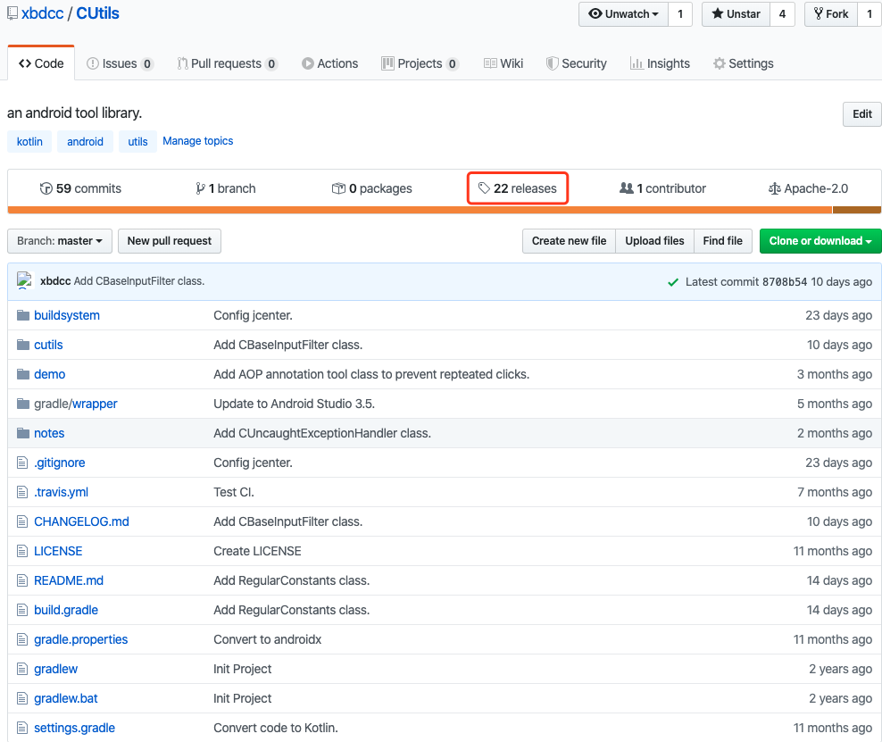
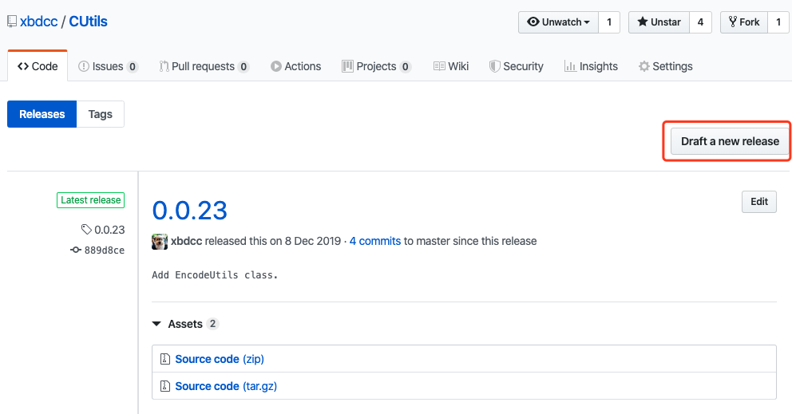
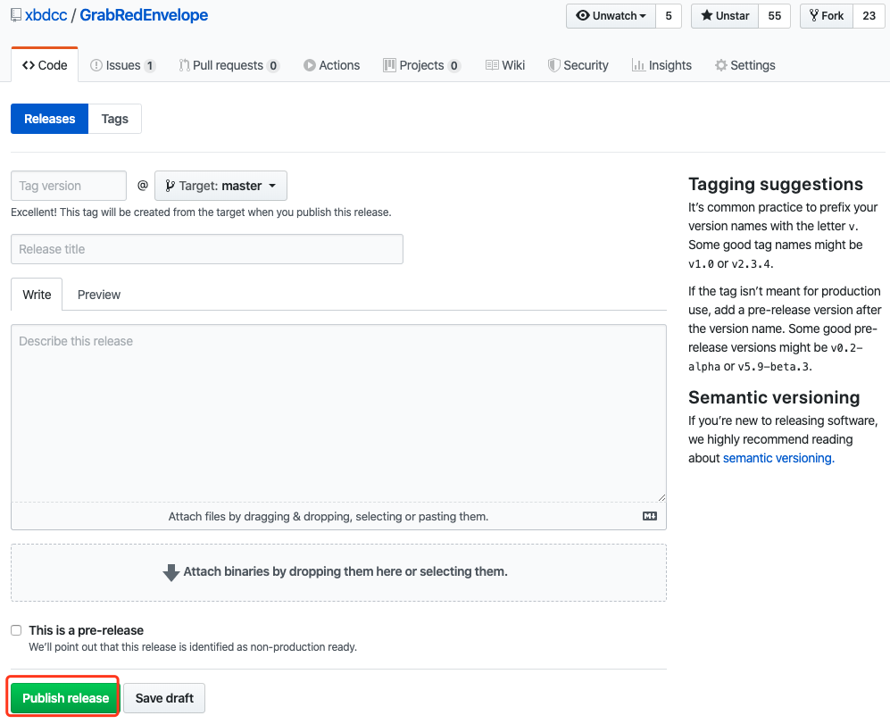
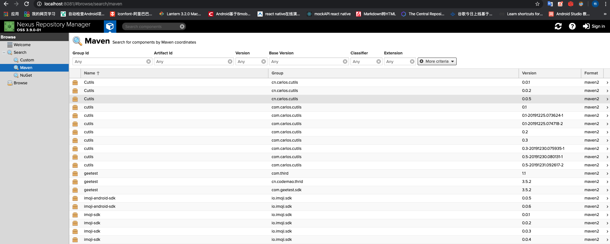
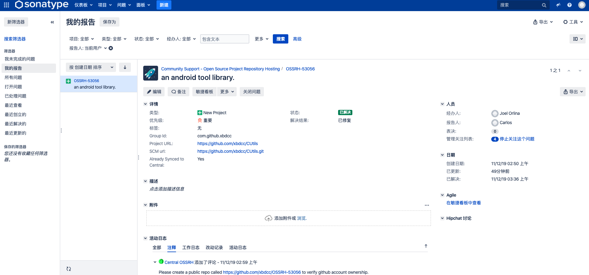
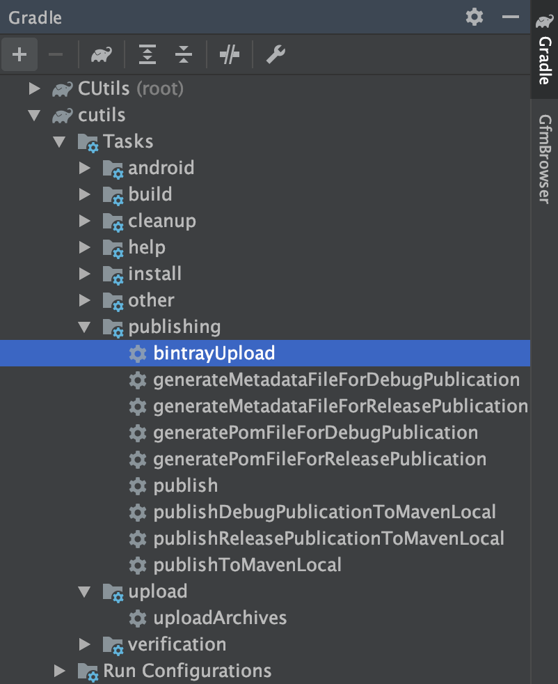

# 如何发布自己的个人仓库？

## 方式一：通过[JitPack](https://jitpack.io/)发布
- 首先新建一个Github仓库，然后可以看到这里有个releases，如下点击

- 然后点击这个`Draft a new release`按钮，如下

- 填写Tag版本号，标题，说明，也可以上传附加文件，点击`Publish releasse`按钮即发布了，如下

- 这个时候在 https://jitpack.io/xbdcc/cutils 上便可以搜到自己发布的版本


## 方式二：发布到[Sonatype](https://search.maven.org/)
### 搭建自己的本地私服`Sonatype Nexus`，配置好环境变量后执行
```
nexus start
```
浏览器打开<http://localhost:8081>

### 申请[Sonatype](https://issues.sonatype.org/secure/Signup!default.jspa)账号，登录后新建如下

按操作一步步来写，然后上传gradle代码块例子如下：
```
apply plugin: 'maven'
uploadArchives {
    repositories.mavenDeployer {
        // url为仓库路径，改为对应本地or其他路径，userName和password分别为Sonatype的用户名和密码
        repository(url: "http://localhost:8081/repository/maven-releases/") {
            authentication(userName: "caochang", password: "xbd")
        }
        snapshotRepository(url: "http://localhost:8081/repository/maven-snapshots/") {
            authentication(userName: "caochang", password: "xbd")
        }
        // 唯一标识
        pom.groupId = "com.carlos.cutils"
        // 项目名称
        pom.artifactId = "cutils"
        // 版本号，若为SNAPSHOT版本则需要在后面加-SNAPSHOT
        pom.version = "0.1-SNAPSHOT"
    }
}
```


## 方式三：发布到[Bintray](https://jcenter.bintray.com/)
- 首先在Bintray地址：https://bintray.com/signup/oss 注册个人账号
- 注册完后创建maven仓库，创建对应的库
- 使用[bintray-release](https://github.com/novoda/bintray-release)插件上传
- 在project的build.gralde添加
```
        classpath 'com.novoda:bintray-release:<latest-version>'
```
- 在library的build.gradle添加
配置如下：
```
apply plugin: 'com.novoda.bintray-release'
publish {
    userOrg = 'xbdcc'
    groupId = 'com.github.xbdcc'
    artifactId = 'cutils'
    publishVersion = '0.0.1'
    desc = 'An android tool library.'
    website = 'https://github.com/xbdcc/CUtils'
}
```
- 配置好后可以通过命令上传
```
./gradlew clean build bintrayUpload -PbintrayUser=BINTRAY_USERNAME(替换为自己的bintray账号） -PbintrayKey=BINTRAY_KEY(替换为自己的bintray key） -PdryRun=false
```
- 也可以通过点击AS工作区右边Gradle的bintrayUpload来上传



## 引用方式
- project gradle下添加仓库地址
```
// 方式一
maven { url 'https://jitpack.io' }
// 方式二
maven { url 'https://oss.sonatype.org/content/repositories/snapshots/' }
maven { url 'http://localhost:8081/repository/maven-releases/' }
// 方式三
maven { url 'https://dl.bintray.com/xbdcc/maven' }
```
- 在app的gradle下添加依赖
```
    implementation 'com.carlos.cutils:cutils:0.0.25'
```


### 参考链接
- [理解Maven中的SNAPSHOT版本和正式版本](https://www.cnblogs.com/huang0925/p/5169624.html)
- [maven/gradle 打包后自动上传到nexus仓库](https://www.cnblogs.com/yjmyzz/p/auto-upload-artifact-to-nexus.html)
- [Android Studio将项目发布到Maven仓库（3种方式最新最全）](https://blog.csdn.net/xmxkf/article/details/80674232)